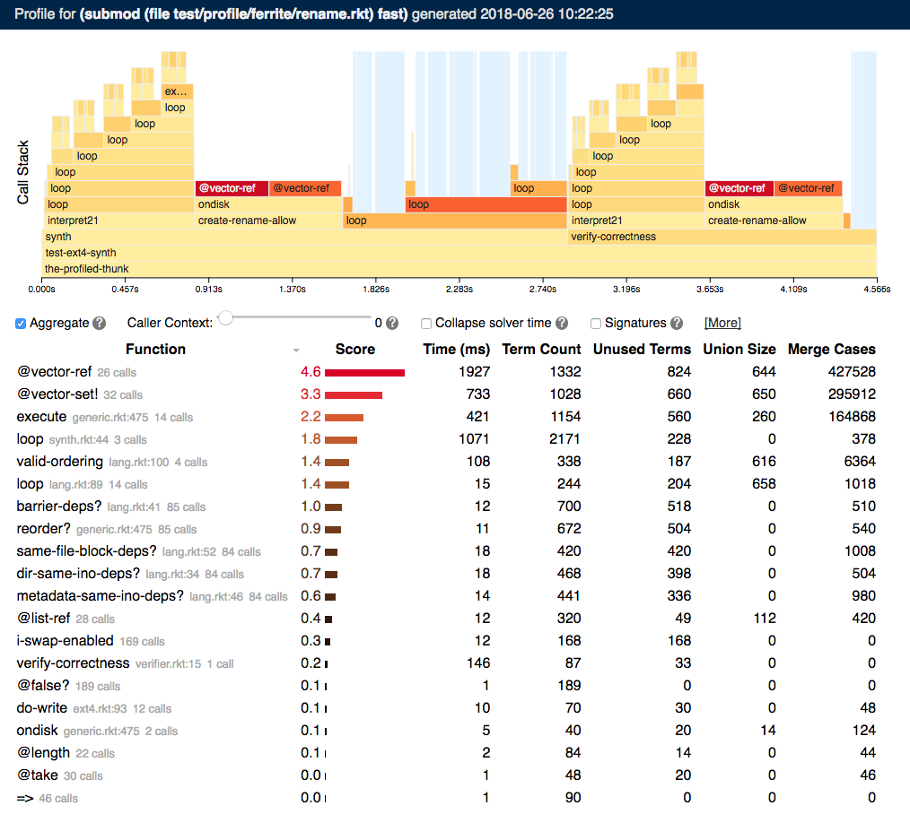

# SymPro UI

This repo contains the frontend for our symbolic profiler. It also includes some sample data (in [`report_data.js`](report_data.js)).




## Using the UI code

The UI code is written in TypeScript, so you'll need a TypeScript compiler to modify the `.ts` files in the [`ts`](ts) directory.
The generated `.js` files are already checked into the repo,
so there's no need to recompile just to open the demo.

The only file that is specific to a particular profile
is [`report_data.js`](report_data.js);
all other files, including [`profile.html`](profile.html),
are generic and can be reused for each profile output.
In our implementation, when the profiler is run,
we simply copy this entire directory into a temporary folder
and add the generated data as a `report_data.js` file.


## Data format

[`report_data.js`](report_data.js) provides the data to the profiler UI by calling `data.receiveData(msgs)`
with a list of *messages*. A message is a JSON object with a field named `type` specifying the message type,
and optional other fields that are message-type-specific.

### `metadata` message

The `metadata` message provides information that renders in the top bar of the profile.

```json
{
    "type": "metadata",
    "form": "",
    "name": "test/profile/ferrite/rename.rkt",
    "source": "(submod (file test/profile/ferrite/rename.rkt) fast)",
    "time": "2018-06-26 10:22:25",
    "version": 1
}
```

The `form` can specify the expression that was profiled, to display it on the profile.
The `name` is the name of the profile.
The `source` is the source of the profiled expression.
The `time` is the time the profile was generated.
The `version` is the version of the data format for the remaining messages (currently version 1).

### `callgraph` message

The `callgraph` message provides the majority of profiling data.

```json
{
    "type": "callgraph",
    "events": [{
        "inputs": {
            "signature": []
        },
        "metrics": {
            "union-count": 0,
            "merge-count": 0,
            "union-size": 0,
            "merge-cases": 0,
            "term-count": 0,
            "time": 1530033741186.846,
            "paths": 0
        },
        "callsite": false,
        "function": "the-profiled-thunk",
        "type": "ENTER",
        "id": 0,
        "source": false
    },
    ...
    ]
}
```

The `events` field provides a list of callgraph events.
Each callgraph event is a JSON object of type either `ENTER` or `EXIT`
(specified in the event's `type` field).
`ENTER` reflects entry to a function call,
and `EXIT` reflects exit from that call.

In ordinary use,
the `ENTER` and `EXIT` events must be balanced---there must never be more `EXIT`s than `ENTER`s.
However,
for streaming purposes,
the final sequence of `EXIT` calls can be omitted
(e.g., for streaming),
in which case all calls with missing `EXIT`s are assumed to still be running.

#### `ENTER` callgraph event

```json
{
    "inputs": {
        "signature": ["concrete", "concrete"]
    },
    "metrics": {
        "union-count": 11,
        "merge-count": 4141,
        "union-size": 30,
        "merge-cases": 8322,
        "term-count": 132,
        "time": 1530033741242.878,
        "paths": 12
    },
    "callsite": "/Users/bornholt/uw/sympro/test/profile/ferrite/lib/lang.rkt:96:14",
    "function": "loop",
    "type": "ENTER",
    "id": 226,
    "source": "/Users/bornholt/uw/sympro/test/profile/ferrite/lib/lang.rkt:89:2"
}
```

The `ENTER` callgraph event is generated at the start of a function call during profiling.

- `inputs` is an optional specification of the *types* and *number* of inputs to the function call.
- `metrics` is a **required** field specifying the value of various execution metrics at the entry to the call.
    - `time` is a requried metric specifying the current (absolute) wall clock time at function entry.
    - the remaining metrics are customizable, and displayed in the profile table after aggregation.
- `callsite` is an optional definition of where the function was called from. If provided, it should be in the format `<file>:<line>:<column>`.
- `function` is the **required** name of the function being called.
- `id` is a **required** unique identifier for this function call (we implement this as a global counter of all function invocations)
- `source` is an optional definition of where the function being called is defined. If provided, it should be in the format `<file>:<line>:<column>`.

#### `EXIT` callgraph event

```json
{
    "metrics": {
        "cpu": 0,
        "union-count": 11,
        "merge-count": 4141,
        "real": 0,
        "union-size": 30,
        "merge-cases": 8322,
        "term-count": 133,
        "time": 1530033741242.897,
        "gc": 0,
        "paths": 12
    },
    "type": "EXIT",
    "outputs": {
        "signature": ["symbolic"]
    }
}
```

The `EXIT` callgraph event is generated at the end of a function call during profiling.

- `metrics` is as for the `ENTER` event.
- `outputs` is an optional specification of the *types* and *number* of outputs from the function call.


### `solver-calls` message

The `solver-calls` message provides information about the types and durations of solver calls.

```json
{
    "type": "solver-calls",
    "events": [{
        "part": "finitize",
        "type": "start",
        "time": 1530033742890.052
    },
    ...
    ]
}
```

The `events` field is a list of solver events.
Each event has type either `start` or `finish`,
a `time` which is the  wallclock time at which the event was generated,
and a `part` specifying which type of solver event it is
(currently, either `finitize`, `encode`, or `solve`).
The `start` and `finish` events must alternate
(i.e., no nesting is allowed)
and must be balanced,
except that the final `finish` can be omitted
(e.g., during streaming),
in which case the solver call is assumed to still be running.


### `unused-terms` message

The `unused-terms` message provides information about the number of terms generated by each function call that went unused.

```json
{
    "type": "unused-terms",
    "data": [
        [6144, 23],
        [6152, 31],
        [2057, 6],
        ...
    ]
}
```

The `data` field is a list of pairs.
The first element of each pair is a function call identifier (the `id` field of the `ENTER` callgraph event, above).
The second element is the number of unused terms generated in that function.
If a function is omitted from `data`, it is assumed to have 0 unused terms.


## Streaming support

The profiler UI supports live streaming of data using a WebSocket.
To activate streaming, pass a list of two messages as the argument to `data.receiveData`.
The first message should be `metadata` as described above.
The second message should be a message of type `stream`, described below.

### `stream` message

The `stream` message starts and finishes live streaming of profile data.

```json
{
    "type": "stream",
    "event": "start",
    "url": "ws://localhost:8677/"
}
```

The `event` field can be either `"start"` or `"finish"`.
If it is `start`, the `url` is a WebSocket URL,
and the profiler UI connects to that WebSocket to receive future profile data messages.
If it is `finish`, the WebSocket connection is closed and no further messages are received
(the `finish` version is intended to be received over the streaming connection).


### WebSocket format

Once the WebSocket is connected,
the profiler UI listens for new messages on the connection.
A message sent to this WebSocket connection
should be a list of profile messages
as described above.
Data from messages received across the WebSocket is accumulated,
so each new message should only provide new data
since the last message was sent,
rather than repeating all previous data.
